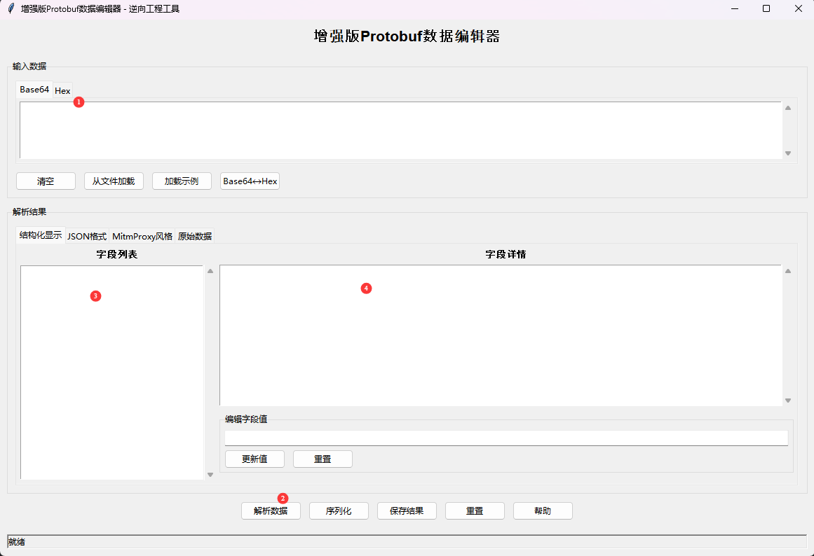
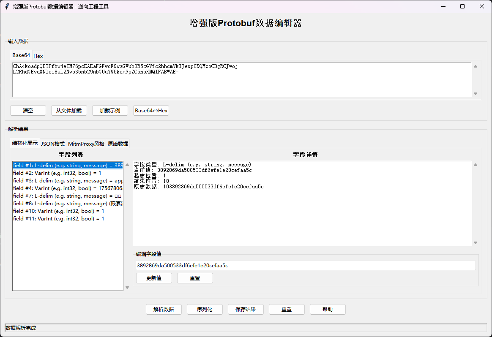

# 增强版Protobuf数据编辑器

这是一个专为逆向工程设计的Protobuf数据编辑器，支持解析、编辑和重新序列化Protobuf数据，提供类似MitmProxy的清晰层次化显示。





## 功能特性

- 🔍 **智能解析**: 基于CyberChef的解析逻辑，准确识别Protobuf字段类型
- 📊 **多种显示格式**: 支持结构化显示、JSON格式、MitmProxy风格和原始数据显示
- ✏️ **实时编辑**: 支持字段值的实时编辑和修改
- 🔄 **重新序列化**: 修改后可以重新序列化为新的Base64数据
- 🎯 **MitmProxy风格**: 提供类似MitmProxy的层次化字段路径显示
- 🛠️ **多格式支持**: 支持Base64和Hex格式的输入输出
- 💾 **保存加载**: 支持解析结果的保存和加载

## 系统要求

- **Python**: 3.7+
- **操作系统**: Windows, macOS, Linux
- **依赖**: tkinter (通常随Python一起安装)

## 安装和使用

### 快速开始

```bash
# 直接运行增强版编辑器
python enhanced_protobuf_editor.py
```

### 详细使用说明

#### 1. 输入数据


- **Base64标签页**: 输入Base64编码的Protobuf数据
- **Hex标签页**: 输入十六进制格式的Protobuf数据
- **格式转换**: 使用"Base64↔Hex"按钮在两种格式间转换
- **文件加载**: 点击"从文件加载"按钮从文件导入数据
- **示例数据**: 点击"加载示例"按钮加载测试数据

#### 2. 解析数据
点击"解析数据"按钮后，编辑器会在多个标签页中显示解析结果：

- **结构化显示**: 字段列表和详细信息，支持编辑
- **JSON格式**: 结构化的JSON显示
- **MitmProxy风格**: 类似MitmProxy的层次化显示
- **原始数据**: 十六进制转储和基本信息

#### 3. 编辑数据
- 在"结构化显示"标签页的字段列表中选择要编辑的字段
- 在右侧的编辑框中输入新值
- 点击"更新值"按钮保存修改
- 使用"重置"按钮恢复原始值

#### 4. 序列化数据
- 点击"序列化"按钮生成新的Protobuf数据
- 结果会显示在弹出窗口中
- 支持复制Base64和Hex格式的数据
- 可以保存序列化结果到文件

## 支持的字段类型

| 显示类型 | 说明 | 示例 |
|----------|------|------|
| `[uint32]` | 32位整数 | `[uint32]     1          123` |
| `[uint64]` | 64位整数 | `[uint64]     2          456789` |
| `[fixed32]` | 32位固定点 | `[fixed32]    3          789` |
| `[string]` | 字符串 | `[string]     4          hello` |
| `[bytes]` | 字节数据 | `[bytes]      5          48656c6c6f` |
| `[message]` | 嵌套消息 | `[message]    6` |

## MitmProxy风格显示

编辑器提供类似MitmProxy的层次化显示格式：


```
[message]    1
[uint32]     1.1        123
[string]     1.2        hello
[message]    1.3
[uint64]     1.3.1      456789
[message]    2
[uint32]     2.1        789
```

### 特点
- 使用层次化路径（如`1.1`, `1.3.1`）表示嵌套结构
- 字段类型用方括号标识
- 值直接显示在类型后面
- 支持重复字段的自动编号

## 使用场景

### 逆向工程
- 分析APK中的Protobuf数据结构
- 修改Protobuf消息进行测试
- 理解复杂的嵌套消息结构

### 开发测试
- 快速生成测试用的Protobuf数据
- 验证Protobuf消息格式
- 调试Protobuf序列化问题

### 数据分析
- 解析网络抓包中的Protobuf数据
- 分析应用程序的数据结构
- 研究Protobuf消息格式

## 高级功能

### 字段编辑
- 支持所有基本数据类型的编辑
- 自动类型转换和验证
- 实时更新显示

### 数据验证
- 自动检测和修复Base64填充问题
- 处理无效字符
- 验证Protobuf格式

### 重复字段处理
- 自动识别和处理重复字段
- 使用序号区分重复字段（如`3`和`3.2`）
- 保持字段的原始顺序

## 故障排除

### 常见问题

1. **解析失败**
   - 检查输入数据是否为有效的Base64或Hex格式
   - 确保数据是完整的Protobuf消息
   - 尝试使用"修复Base64"功能

2. **字段显示不完整**
   - 某些复杂的嵌套结构可能需要特殊处理
   - 检查原始数据标签页中的十六进制转储

3. **序列化结果不正确**
   - 确保所有字段值都是有效的
   - 检查字段类型是否匹配
   - 验证修改后的数据结构

### 调试技巧

- 使用"原始数据"标签页查看十六进制转储
- 对比"JSON格式"和"MitmProxy风格"的显示结果
- 使用示例数据进行测试

## 技术特性

- **解析引擎**: 基于CyberChef的Protobuf解析逻辑
- **UI框架**: 使用tkinter构建的跨平台GUI
- **数据处理**: 支持大文件的快速解析
- **内存优化**: 高效的数据结构和算法

## 更新日志

### v1.0.0
- 初始版本发布
- 基础Protobuf解析和编辑功能
- 支持多种显示格式
- 实时编辑和序列化

## 许可证

MIT License

## 贡献

欢迎提交Issue和Pull Request来改进这个工具。